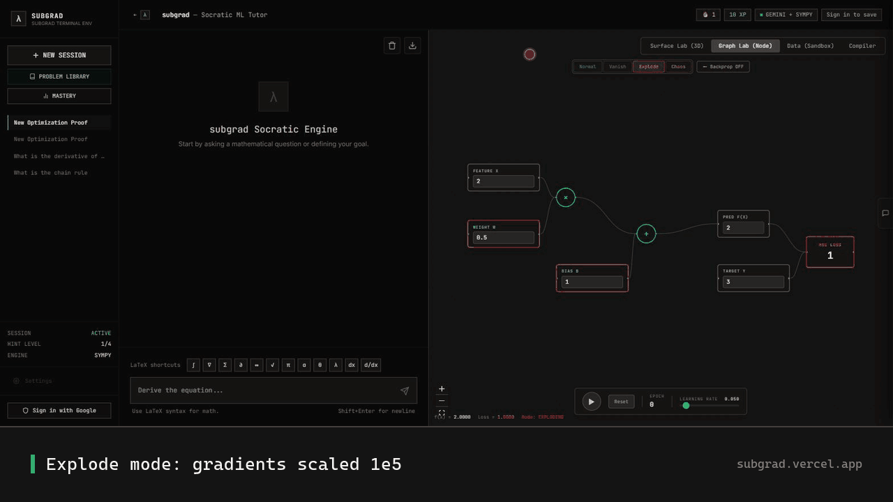

# SubGrad

**Four interactive labs for the parts of ML that never click from reading.**

Live at **[subgrad.vercel.app](https://subgrad.vercel.app)** — no signup, runs
in the browser.



You can recite the chain rule and still have no feel for what a learning rate
of 0.9 actually does to a run. Reading more doesn't fix that — so this is
somewhere to break things instead.

## The four labs

| Lab | What you do | What it teaches |
|---|---|---|
| **Surface Lab** | Step gradient descent through a 3D loss surface (bowl / saddle / Rosenbrock), learning-rate slider | Step size vs. convergence vs. divergence; why saddle points are the real problem |
| **Graph Lab** | Watch gradients flow backward through a computation graph; flip on exploding / vanishing / chaotic modes | Where in the graph the damage starts, not just NaN at the end |
| **Data Sandbox** | Drag one point, watch an OLS fit and its MSE recompute live | Leverage and influence — why one outlier can own the whole fit |
| **Shape Checker** | Paste a model definition, get dimension mismatches flagged statically | Distance between where a shape first broke and where it finally threw |

A Socratic tutor watches lab state, not just the chat — when your loss
diverges, it interrupts *there* and asks what you think just happened. It's
threshold-triggered right now, not the model reasoning over your full
trajectory, and all math is verified through SymPy rather than generated by
the model.

## Status

Solo project. Zero users. Desktop only — the labs assume a wide screen, and
on a phone it's genuinely bad. The backend is a free Render instance, so the
first request after it's been idle cold-starts for 30–60 seconds.

## Stack

- **Frontend:** React, Vite, Tailwind CSS, Zustand, Three.js (via React Three
  Fiber), React Flow, Framer Motion
- **Backend:** FastAPI, SymPy, Google Gemini (function calling)
- **Infra:** Vercel (frontend), Render (backend), Supabase (Postgres + Auth)

## Running it locally

```bash
# backend
cd backend
pip install -r requirements.txt
cp .env.example .env   # fill in GEMINI_API_KEY
uvicorn app.main:app --reload

# frontend, in a second terminal
cd frontend
npm install
npm run dev
```

Guest mode works with no backend calls required for most of the labs; the
Socratic tutor chat needs `GEMINI_API_KEY` set. See
[docs/DEPLOYMENT.md](docs/DEPLOYMENT.md) for the full deploy runbook
(Render + Vercel + Supabase + Google OAuth).

## Repo layout

```
frontend/     React app — the four labs, landing page, chat UI
backend/      FastAPI + SymPy math engine + Gemini tutor
supabase/     Auth + session-persistence schema
marketing/    Brand context, launch copy, demo clips, content tracker
docs/         Planning docs and PRDs from the build (historical record)
```

## Credit

Built with prior art from [TensorFlow Playground](https://playground.tensorflow.org/),
[distill.pub](https://distill.pub/), and [micrograd](https://github.com/karpathy/micrograd).
